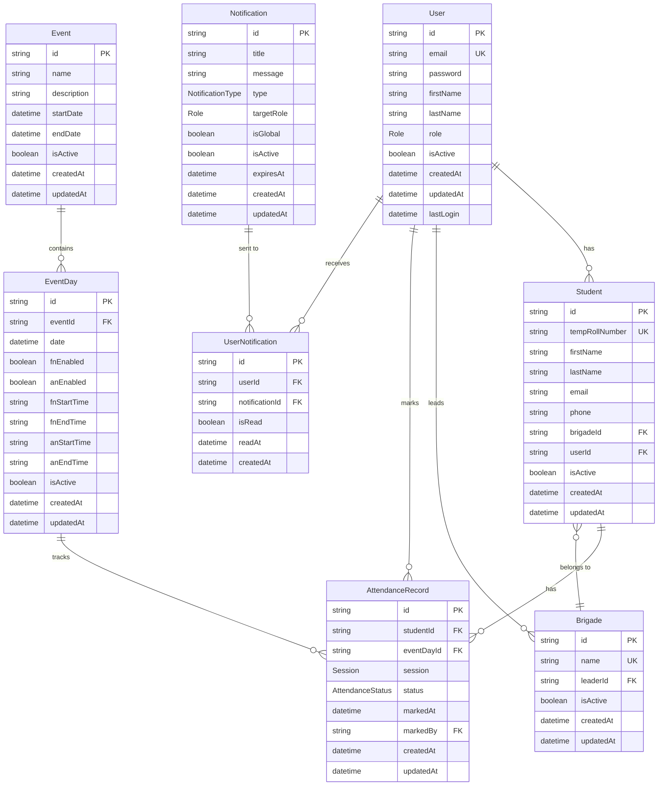

# Database Schema Documentation

## Overview

The Ignite Attendance Management System uses PostgreSQL as its primary database with Prisma as the ORM. The schema is designed to support multi-role user management, brigade organization, event management, and comprehensive attendance tracking.

## Schema Design Principles

- **Normalization**: Follows 3NF to minimize data redundancy
- **Referential Integrity**: Foreign key constraints ensure data consistency
- **Soft Deletes**: Uses `isActive` flags instead of hard deletes where appropriate
- **Audit Trail**: Includes `createdAt` and `updatedAt` timestamps
- **Scalability**: Designed to handle thousands of students and events

## Entity Relationship Diagram



## Tables

### Users Table

Stores all user accounts in the system with role-based access control.

```sql
CREATE TABLE users (
    id TEXT PRIMARY KEY DEFAULT gen_random_uuid(),
    email TEXT UNIQUE NOT NULL,
    password TEXT NOT NULL,
    firstName TEXT NOT NULL,
    lastName TEXT NOT NULL,
    role Role DEFAULT 'STUDENT',
    isActive BOOLEAN DEFAULT true,
    createdAt TIMESTAMP(3) DEFAULT CURRENT_TIMESTAMP,
    updatedAt TIMESTAMP(3) DEFAULT CURRENT_TIMESTAMP,
    lastLogin TIMESTAMP(3)
);
```

**Columns:**
- `id`: Unique identifier (CUID)
- `email`: User's email address (unique)
- `password`: Hashed password using bcrypt
- `firstName`: User's first name
- `lastName`: User's last name
- `role`: User role (ADMIN, BRIGADE_LEAD, STUDENT)
- `isActive`: Account status flag
- `createdAt`: Account creation timestamp
- `updatedAt`: Last modification timestamp
- `lastLogin`: Last successful login timestamp

**Indexes:**
```sql
CREATE UNIQUE INDEX users_email_key ON users(email);
```

### Students Table

Stores student-specific information and links to user accounts.

```sql
CREATE TABLE students (
    id TEXT PRIMARY KEY DEFAULT gen_random_uuid(),
    tempRollNumber TEXT UNIQUE NOT NULL,
    firstName TEXT NOT NULL,
    lastName TEXT NOT NULL,
    email TEXT,
    phone TEXT,
    brigadeId TEXT REFERENCES brigades(id) ON DELETE SET NULL,
    userId TEXT UNIQUE REFERENCES users(id) ON DELETE SET NULL,
    isActive BOOLEAN DEFAULT true,
    createdAt TIMESTAMP(3) DEFAULT CURRENT_TIMESTAMP,
    updatedAt TIMESTAMP(3) DEFAULT CURRENT_TIMESTAMP
);
```

**Columns:**
- `id`: Unique identifier
- `tempRollNumber`: Temporary roll number (unique, e.g., IG2026001)
- `firstName`: Student's first name
- `lastName`: Student's last name
- `email`: Student's email (optional)
- `phone`: Student's phone number (optional)
- `brigadeId`: Reference to brigade (nullable)
- `userId`: Reference to user account (nullable, unique)
- `isActive`: Student status flag
- `createdAt`: Record creation timestamp
- `updatedAt`: Last modification timestamp

**Indexes:**
```sql
CREATE UNIQUE INDEX students_tempRollNumber_key ON students(tempRollNumber);
CREATE UNIQUE INDEX students_userId_key ON students(userId);
CREATE INDEX students_brigadeId_idx ON students(brigadeId);
```

### Brigades Table

Organizes students into groups with assigned leaders.

```sql
CREATE TABLE brigades (
    id TEXT PRIMARY KEY DEFAULT gen_random_uuid(),
    name TEXT UNIQUE NOT NULL,
    leaderId TEXT REFERENCES users(id) ON DELETE SET NULL,
    isActive BOOLEAN DEFAULT true,
    createdAt TIMESTAMP(3) DEFAULT CURRENT_TIMESTAMP,
    updatedAt TIMESTAMP(3) DEFAULT CURRENT_TIMESTAMP
);
```

**Columns:**
- `id`: Unique identifier
- `name`: Brigade name (unique, e.g., "Brigade Alpha")
- `leaderId`: Reference to brigade leader user (nullable)
- `isActive`: Brigade status flag
- `createdAt`: Brigade creation timestamp
- `updatedAt`: Last modification timestamp

**Indexes:**
```sql
CREATE UNIQUE INDEX brigades_name_key ON brigades(name);
CREATE INDEX brigades_leaderId_idx ON brigades(leaderId);
```

### Events Table

Stores information about events requiring attendance tracking.

```sql
CREATE TABLE events (
    id TEXT PRIMARY KEY DEFAULT gen_random_uuid(),
    name TEXT NOT NULL,
    description TEXT,
    startDate TIMESTAMP(3) NOT NULL,
    endDate TIMESTAMP(3) NOT NULL,
    isActive BOOLEAN DEFAULT true,
    createdAt TIMESTAMP(3) DEFAULT CURRENT_TIMESTAMP,
    updatedAt TIMESTAMP(3) DEFAULT CURRENT_TIMESTAMP
);
```

**Columns:**
- `id`: Unique identifier
- `name`: Event name (e.g., "Ignite 2026")
- `description`: Event description (optional)
- `startDate`: Event start date and time
- `endDate`: Event end date and time
- `isActive`: Event status flag
- `createdAt`: Event creation timestamp
- `updatedAt`: Last modification timestamp

**Indexes:**
```sql
CREATE INDEX events_startDate_idx ON events(startDate);
CREATE INDEX events_isActive_idx ON events(isActive);
```

### Event Days Table

Defines specific days within events with session configurations.

```sql
CREATE TABLE event_days (
    id TEXT PRIMARY KEY DEFAULT gen_random_uuid(),
    eventId TEXT NOT NULL REFERENCES events(id) ON DELETE CASCADE,
    date TIMESTAMP(3) NOT NULL,
    fnEnabled BOOLEAN DEFAULT true,
    anEnabled BOOLEAN DEFAULT true,
    fnStartTime TEXT DEFAULT '09:00',
    fnEndTime TEXT DEFAULT '09:30',
    anStartTime TEXT DEFAULT '14:00',
    anEndTime TEXT DEFAULT '14:30',
    isActive BOOLEAN DEFAULT true,
    createdAt TIMESTAMP(3) DEFAULT CURRENT_TIMESTAMP,
    updatedAt TIMESTAMP(3) DEFAULT CURRENT_TIMESTAMP
);
```

**Columns:**
- `id`: Unique identifier
- `eventId`: Reference to parent event
- `date`: Specific date for this event day
- `fnEnabled`: Whether forenoon session is enabled
- `anEnabled`: Whether afternoon session is enabled
- `fnStartTime`: Forenoon session start time (HH:MM format)
- `fnEndTime`: Forenoon session end time (HH:MM format)
- `anStartTime`: Afternoon session start time (HH:MM format)
- `anEndTime`: Afternoon session end time (HH:MM format)
- `isActive`: Event day status flag
- `createdAt`: Record creation timestamp
- `updatedAt`: Last modification timestamp

**Indexes:**
```sql
CREATE INDEX event_days_eventId_idx ON event_days(eventId);
CREATE INDEX event_days_date_idx ON event_days(date);
```

### Attendance Records Table

Tracks individual attendance records for students.

```sql
CREATE TABLE attendance_records (
    id TEXT PRIMARY KEY DEFAULT gen_random_uuid(),
    studentId TEXT NOT NULL REFERENCES students(id) ON DELETE CASCADE,
    eventDayId TEXT NOT NULL REFERENCES event_days(id) ON DELETE CASCADE,
    session Session NOT NULL,
    status AttendanceStatus DEFAULT 'PRESENT',
    markedAt TIMESTAMP(3) DEFAULT CURRENT_TIMESTAMP,
    markedBy TEXT REFERENCES users(id) ON DELETE SET NULL,
    createdAt TIMESTAMP(3) DEFAULT CURRENT_TIMESTAMP,
    updatedAt TIMESTAMP(3) DEFAULT CURRENT_TIMESTAMP,
    UNIQUE(studentId, eventDayId, session)
);
```

**Columns:**
- `id`: Unique identifier
- `studentId`: Reference to student
- `eventDayId`: Reference to event day
- `session`: Session type (FN or AN)
- `status`: Attendance status (PRESENT, ABSENT, LATE)
- `markedAt`: When attendance was marked
- `markedBy`: Who marked the attendance (nullable)
- `createdAt`: Record creation timestamp
- `updatedAt`: Last modification timestamp

**Constraints:**
- Unique constraint on (studentId, eventDayId, session) prevents duplicate attendance records

**Indexes:**
```sql
CREATE UNIQUE INDEX attendance_records_studentId_eventDayId_session_key 
ON attendance_records(studentId, eventDayId, session);
CREATE INDEX attendance_records_studentId_idx ON attendance_records(studentId);
CREATE INDEX attendance_records_eventDayId_idx ON attendance_records(eventDayId);
CREATE INDEX attendance_records_markedAt_idx ON attendance_records(markedAt);
```

### Notifications Table

Stores system-wide notifications and announcements.

```sql
CREATE TABLE notifications (
    id TEXT PRIMARY KEY DEFAULT gen_random_uuid(),
    title TEXT NOT NULL,
    message TEXT NOT NULL,
    type NotificationType DEFAULT 'INFO',
    targetRole Role,
    isGlobal BOOLEAN DEFAULT false,
    isActive BOOLEAN DEFAULT true,
    expiresAt TIMESTAMP(3),
    createdAt TIMESTAMP(3) DEFAULT CURRENT_TIMESTAMP,
    updatedAt TIMESTAMP(3) DEFAULT CURRENT_TIMESTAMP
);
```

**Columns:**
- `id`: Unique identifier
- `title`: Notification title
- `message`: Notification content
- `type`: Notification type (INFO, WARNING, ERROR, SUCCESS)
- `targetRole`: Target user role (nullable for all roles)
- `isGlobal`: Whether notification is for all users
- `isActive`: Notification status flag
- `expiresAt`: Expiration timestamp (nullable)
- `createdAt`: Notification creation timestamp
- `updatedAt`: Last modification timestamp

**Indexes:**
```sql
CREATE INDEX notifications_targetRole_idx ON notifications(targetRole);
CREATE INDEX notifications_isGlobal_idx ON notifications(isGlobal);
CREATE INDEX notifications_createdAt_idx ON notifications(createdAt);
```

### User Notifications Table

Junction table tracking which users have received which notifications.

```sql
CREATE TABLE user_notifications (
    id TEXT PRIMARY KEY DEFAULT gen_random_uuid(),
    userId TEXT NOT NULL REFERENCES users(id) ON DELETE CASCADE,
    notificationId TEXT NOT NULL REFERENCES notifications(id) ON DELETE CASCADE,
    isRead BOOLEAN DEFAULT false,
    readAt TIMESTAMP(3),
    createdAt TIMESTAMP(3) DEFAULT CURRENT_TIMESTAMP,
    UNIQUE(userId, notificationId)
);
```

**Columns:**
- `id`: Unique identifier
- `userId`: Reference to user
- `notificationId`: Reference to notification
- `isRead`: Whether user has read the notification
- `readAt`: When notification was read (nullable)
- `createdAt`: Record creation timestamp

**Constraints:**
- Unique constraint on (userId, notificationId) prevents duplicate user notifications

**Indexes:**
```sql
CREATE UNIQUE INDEX user_notifications_userId_notificationId_key 
ON user_notifications(userId, notificationId);
CREATE INDEX user_notifications_userId_idx ON user_notifications(userId);
CREATE INDEX user_notifications_isRead_idx ON user_notifications(isRead);
```

## Enums

### Role Enum
```sql
CREATE TYPE Role AS ENUM ('ADMIN', 'BRIGADE_LEAD', 'STUDENT');
```

Defines user roles in the system:
- `ADMIN`: Full system access
- `BRIGADE_LEAD`: Brigade management and attendance marking
- `STUDENT`: View own attendance and profile

### Session Enum
```sql
CREATE TYPE Session AS ENUM ('FN', 'AN');
```

Defines attendance sessions:
- `FN`: Forenoon session
- `AN`: Afternoon session

### AttendanceStatus Enum
```sql
CREATE TYPE AttendanceStatus AS ENUM ('PRESENT', 'ABSENT', 'LATE');
```

Defines attendance status options:
- `PRESENT`: Student attended on time
- `ABSENT`: Student did not attend
- `LATE`: Student arrived late

### NotificationType Enum
```sql
CREATE TYPE NotificationType AS ENUM ('INFO', 'WARNING', 'ERROR', 'SUCCESS');
```

Defines notification types:
- `INFO`: General information
- `WARNING`: Important notices
- `ERROR`: Error messages
- `SUCCESS`: Success confirmations

## Data Relationships

### One-to-One Relationships
- `User` ↔ `Student`: Each student can have one user account
- `Brigade` ↔ `User` (leader): Each brigade can have one leader

### One-to-Many Relationships
- `Brigade` → `Student`: One brigade contains many students
- `Event` → `EventDay`: One event has many days
- `EventDay` → `AttendanceRecord`: One event day has many attendance records
- `Student` → `AttendanceRecord`: One student has many attendance records
- `User` → `AttendanceRecord` (marker): One user can mark many attendance records
- `Notification` → `UserNotification`: One notification can be sent to many users
- `User` → `UserNotification`: One user can receive many notifications

### Many-to-Many Relationships
- `User` ↔ `Notification` (through `UserNotification`): Users can receive multiple notifications

## Data Integrity Rules

### Foreign Key Constraints
- All foreign keys use appropriate CASCADE or SET NULL actions
- Attendance records are deleted when students or event days are deleted
- User notifications are deleted when users are deleted
- Brigade assignments are nullified when brigades are deleted

### Unique Constraints
- User emails must be unique
- Student roll numbers must be unique
- Brigade names must be unique
- One attendance record per student per session per event day

### Check Constraints
```sql
-- Ensure event end date is after start date
ALTER TABLE events ADD CONSTRAINT events_date_check 
CHECK (endDate > startDate);

-- Ensure session times are valid
ALTER TABLE event_days ADD CONSTRAINT event_days_fn_time_check 
CHECK (fnEndTime > fnStartTime);

ALTER TABLE event_days ADD CONSTRAINT event_days_an_time_check 
CHECK (anEndTime > anStartTime);
```

## Performance Considerations

### Indexing Strategy

#### Primary Indexes
All tables have primary key indexes automatically created.

#### Secondary Indexes
```sql
-- User lookups
CREATE INDEX users_role_idx ON users(role);
CREATE INDEX users_isActive_idx ON users(isActive);

-- Student searches
CREATE INDEX students_name_idx ON students(firstName, lastName);
CREATE INDEX students_email_idx ON students(email);

-- Attendance queries
CREATE INDEX attendance_records_status_idx ON attendance_records(status);
CREATE INDEX attendance_records_session_idx ON attendance_records(session);

-- Date-based queries
CREATE INDEX event_days_date_active_idx ON event_days(date, isActive);
CREATE INDEX attendance_records_date_idx ON attendance_records(DATE(markedAt));
```

#### Composite Indexes
```sql
-- Common query patterns
CREATE INDEX students_brigade_active_idx ON students(brigadeId, isActive);
CREATE INDEX attendance_student_date_idx ON attendance_records(studentId, eventDayId);
CREATE INDEX notifications_role_active_idx ON notifications(targetRole, isActive);
```

### Query Optimization

#### Efficient Pagination
```sql
-- Use OFFSET and LIMIT with proper ordering
SELECT * FROM students 
WHERE isActive = true 
ORDER BY createdAt DESC 
LIMIT 20 OFFSET 40;
```

#### Attendance Statistics
```sql
-- Optimized attendance percentage calculation
SELECT 
  s.id,
  s.tempRollNumber,
  COUNT(ar.id) as total_sessions,
  COUNT(CASE WHEN ar.status = 'PRESENT' THEN 1 END) as present_sessions,
  ROUND(
    COUNT(CASE WHEN ar.status = 'PRESENT' THEN 1 END) * 100.0 / 
    NULLIF(COUNT(ar.id), 0), 2
  ) as attendance_percentage
FROM students s
LEFT JOIN attendance_records ar ON s.id = ar.studentId
WHERE s.isActive = true
GROUP BY s.id, s.tempRollNumber;
```

## Backup and Recovery

### Backup Strategy
```sql
-- Full database backup
pg_dump -h localhost -U ignite_user ignite2026_db > backup_$(date +%Y%m%d).sql

-- Schema-only backup
pg_dump -h localhost -U ignite_user --schema-only ignite2026_db > schema_backup.sql

-- Data-only backup
pg_dump -h localhost -U ignite_user --data-only ignite2026_db > data_backup.sql
```

### Point-in-Time Recovery
Enable WAL archiving for point-in-time recovery:
```sql
-- In postgresql.conf
wal_level = replica
archive_mode = on
archive_command = 'cp %p /path/to/archive/%f'
```

## Migration Strategy

### Schema Versioning
Prisma handles schema migrations automatically:
```bash
# Generate migration
npx prisma migrate dev --name add_new_feature

# Apply migrations to production
npx prisma migrate deploy
```

### Data Migration Scripts
```sql
-- Example: Adding default values for existing records
UPDATE event_days 
SET fnStartTime = '09:00', fnEndTime = '09:30'
WHERE fnStartTime IS NULL;
```

## Security Considerations

### Row Level Security (RLS)
```sql
-- Enable RLS on sensitive tables
ALTER TABLE students ENABLE ROW LEVEL SECURITY;

-- Policy for brigade leads to see only their students
CREATE POLICY brigade_lead_students ON students
FOR ALL TO brigade_lead_role
USING (
  brigadeId IN (
    SELECT id FROM brigades WHERE leaderId = current_user_id()
  )
);
```

### Data Encryption
- Passwords are hashed using bcrypt
- Sensitive data should be encrypted at rest
- Use SSL/TLS for data in transit

### Access Control
- Database users have minimal required permissions
- Application uses connection pooling
- Prepared statements prevent SQL injection

This schema documentation provides a comprehensive overview of the database design, relationships, and best practices for the Ignite 2026 Attendance Management System.